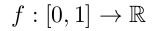
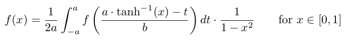
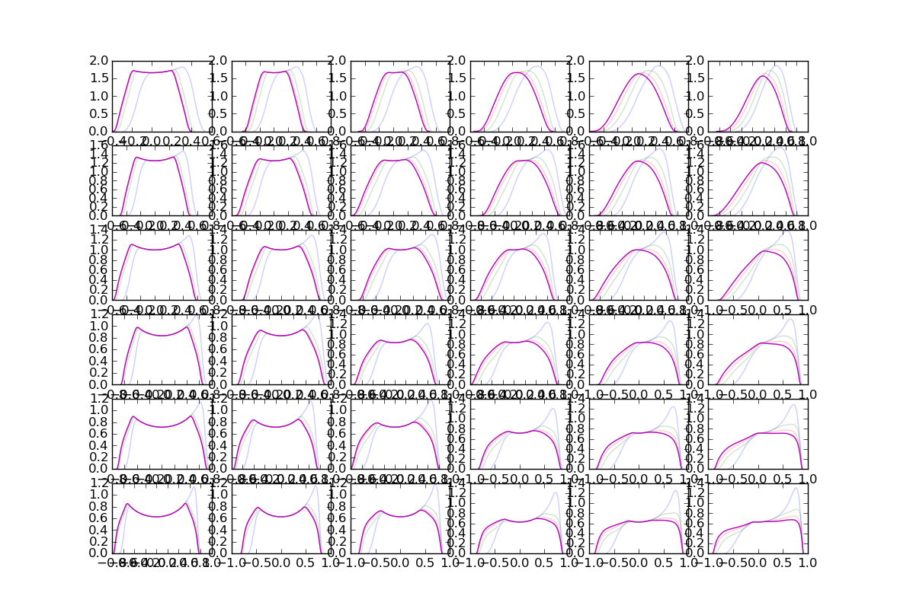

Piecewise-linear functions
==========================

`plf` is a library that implements a piecewise-linear function (which is a real function of a real variable) and defines basic operation with it: addition, subtraction, multiplication, division, function composition, and taking definite integral. 

It is used as an approximation of a continuous function (more precisely the density of a random variable) in the sample file `fixpoint-nn.py`, which tries to solve a functional equation for various parameters.

The demostration uses fixpoint-iteration method for solving the following functional problem.

Find real function  such that:

Demonstration
-------------
	python3 fixpoint-nn.py

Dependencies
------------
- `python3`
- `python3-matplotlib`
- `python3-numpy`
